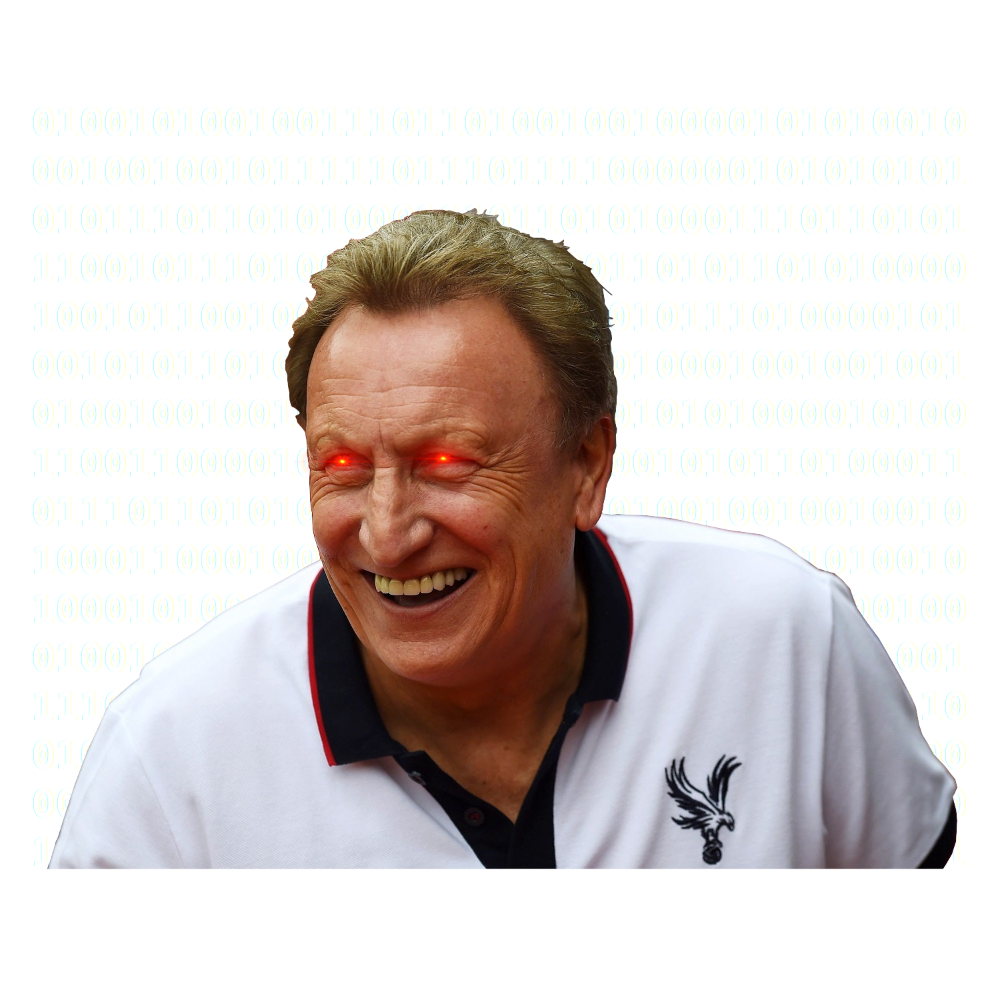

</img>

# ⚽️ NeilWarnockAI ⚽️

Premier League analysis and FPL (Fanstasy Premier League) autonomous agent project, with the aim of __running riot__ in
the 2021/2022 FPL season.

🚀 Top 🏅 1% here we come! 🚀

🙌 Let's make 👑 Neil proud! 🙌

---

### 🏆️ Some of Neil's best quotes for the reader's enjoyment 🏆

> When I pass away, I don't want clapping or a minute's silence, I want a minute's booing at Bristol City.

> Matches don't come any bigger the FA cup quarter-finals.

Inspiring words from one of the truly great wordsmiths of our time.

---

## Issues and Core Problems:

1. __Model Design question?__

	Should we average a player's performance stats over the number of games he featured in the `lookback` scope?

	_OR_

	Should we average a player's performance stats over the number of games in the `lookback` scope for every player, regardless of whether the player is included in the other gameweek statistic dataframes? 

__@Noah:__

See `devlog.md` for a more detailed description of the current approach.

## TODO:

- [x] Choose predictive strategy
- [x] Start on proof-of-concept (PoC.jl)
- [ ] Autonomously updating gameweek data fetching
- [ ] Filter incoming model-training and test-point data (indentify necessary features)
- [ ] Working player gameweek points prediction `pp_prediction`
